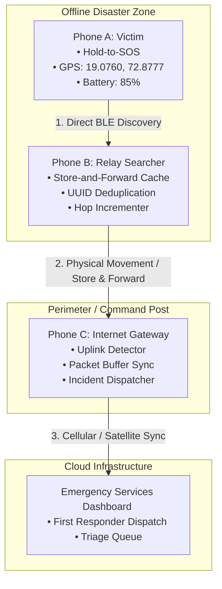

# Aapad Setu

> **Offline-first, opportunistic peer-to-peer store-and-forward emergency mesh network for post-disaster scenarios.**

---

## 1. The Problem

During natural disasters (earthquakes, cyclones, floods, tsunamis, landslides) and catastrophic infrastructure failures, commercial cellular towers and internet service frequently collapse or suffer total blackouts.

Traditional emergency apps depend entirely on:
- Active cellular connectivity
- Continuous internet access
- Centralized cloud servers

When both cellular networks and internet connectivity are unavailable, victims and first responders are left without communication channels.

---

## 2. The Aapad-Setu Solution

**Aapad-Setu** operates completely offline using opportunistic peer-to-peer communication:

```
[VICTIM PHONE A] (Offline) 
       ↓ (BLE / Wi-Fi Aware Direct)
[RELAY PHONE B] (Offline Hiker / Searcher)
       ↓ (Opportunistic Store & Forward)
[GATEWAY PHONE C] (Emergency Command Vehicle)
       ↓ (4G / 5G / Starlink Satellite Uplink)
[EMERGENCY DISPATCH CLOUD]
```

A distress message travels opportunistically between participating physical devices as individuals move through disaster zones until one device reaches an active network gateway.

---

## 3. Architecture & Mermaid Diagram



---

## 4. P2P Emergency Packet Format

Each SOS broadcast is serialized as a lightweight, compact JSON packet:

```json
{
  "packetId": "Aapad-Setu-a842-1710892800",
  "type": "SOS",
  "senderId": "R-1842",
  "createdAt": "14:22:10.4",
  "latitude": 19.0760,
  "longitude": 72.8777,
  "locationAccuracy": 8,
  "battery": 85,
  "status": "TRAPPED",
  "bloodGroup": "O+",
  "medicalNotes": "Asthmatic, conscious under debris",
  "hopCount": 0,
  "ttl": 8,
  "priority": "CRITICAL",
  "deliveryState": "LOCAL",
  "journeyHistory": [
    {
      "node": "Node A (Victim)",
      "action": "ORIGINATED",
      "time": "14:22:10.4",
      "rssi": -38
    }
  ]
}
```

---

## 5. Core Routing Mechanics

### A. Store-and-Forward Relay Algorithm
1. **Origination:** Node A creates a packet with `hopCount = 0` and `ttl = 8`.
2. **Transfer:** When encountering Node B, Node A transmits the packet over direct peer-to-peer radio.
3. **Deduplication:** Node B checks its local cache. If `packetId` is already present, the incoming packet is dropped to prevent rebroadcast storms.
4. **TTL & Hop Update:** Node B increments `hopCount = 1`, decrements `ttl = 7`, and stores the packet in its outbox.
5. **Gateway Uplink:** When Node B encounters Node C (which has active cellular or satellite connectivity), Node C validates the payload and uploads it to the Emergency Services API.

### B. Priority Queuing
Packets are sorted by priority before transmission over bandwidth-constrained peer links:
1. `CRITICAL` (Immediate life-threat / Trapped)
2. `HIGH` (Injured / Urgent medical need)
3. `NORMAL` (General assistance / Safe check-ins)

---

## 6. Scientific Honesty & Real-World Physics

- **RSSI Inaccuracy:** Received Signal Strength Indicator (RSSI) cannot determine exact geometric distance in collapsed structures due to multipath reflections, wall attenuation, and antenna orientation. Aapad-Setu groups signals into discrete proximity confidence bands.
- **Satellite GPS Attenuation:** GPS satellite signals may degrade under heavy concrete rubble. The application transmits the last high-accuracy fix obtained prior to structural entry.
- **Physical Mesh Range:** Direct BLE ranges span 10–30 meters; multi-hop opportunistic forwarding bridges kilometer-scale gaps through physical mobility.

---

## 7. 3-Phone Demonstration Instructions

To demonstrate to hackathon judges:
1. **Step 1:** On **Phone A (Victim)**, hold the red **SOS** button for 3 seconds. Observe the circular progress ring and emergency activation.
2. **Step 2:** Click **"2. B Meets A"** or **"Simulate Hop"**. Note that Phone B discovers Phone A, suppresses duplicates, and caches the packet with Hop 1.
3. **Step 3:** Click **"3. A Leaves"**. Phone A disconnects, proving Phone B holds the packet independently.
4. **Step 4:** Click **"4. B Meets C"**. Phone B encounters Gateway Phone C and forwards the cached packet.
5. **Step 5:** Phone C detects internet connectivity and uploads the packet to the Emergency Cloud Dispatch Center.
6. Open the **Network Inspector** tab to view the immutable end-to-end hop ledger.
